# Dynamo Unchained 1

Learn how to develop Zero Touch Nodes in C#.

[TOC]

##Author info

Matteo is a Design Automation Developer at Arup in the Technical Software Group and works closely
with the building engineering teams to help drive automation, optimization, digital design and to bring new technologies to the existing processes. Possessing a multidisciplinary background in architecture, engineering, and software development, he focuses on enhancing BIM, virtual design and construction,
parametric design and open standards. Matteo has previously worked at Foster + Partners in the Applied Research and Development team, at WeWork and at CASE to deliver leading solutions for projects and software tools. Matteo is also author of several open source applications which deal with data exchange, issue tracking and automation.

## Summary

This workshop will teach you how to set your graph free by developing custom Dynamo nodes using the Zero Touch approach. It will go thorough the different types on nodes and their advantages, then it will teach you how to configure Visual Studio for development and debug. Finally, using simple examples, it will teach you how to build your own nodes. 
After this workshop you will be able to add new features, improve workflows and contribute to the Dynamo community.  The workshop will be using Visual Studio and C#, for information on getting started with C# please see the links in the [Additional Resources](#Additional Resources) section.

### Learning objectives

* Learn about the different types of custom Dynamo nodes
* Lear how to set up the Visual Studio environment for development and debug with Dynamo
* Learn how to develop, test and deploy a Zero Touch node

### Tools we’ll use

* [Visual Studio Community 2017](https://www.visualstudio.com/downloads/)

* Autodesk Revit 2018 (or Autodesk Revit 2017 and Dynamo 1.3)

## What are custom nodes?

In Dynamo it is possible to add custom functionalities using special components, these are called custom nodes. They can be really useful for frequently used routines or for adding completely new and advanced features. 

### Advantages

* Simplify the graph, keep it clean and intuitive

* Reusability 

* Modularity, update all custom nodes of the same type at once

* Better use of conditional statements (if/then) and looping

* Add brand new functionalities

* Integrate with external services/libraries

* Understand better how Dynamo "thinks"

* Contribute to the community

### Disadvantages

* Less intuitive than visual programming

* Hard for novice users/learning curve

* Some custom nodes require compiling DLLs

* With great power comes great responsibility, custom nodes are more prone to bugs, memory abuse or crashes 

### Types of custom nodes

There are different types of custom nodes, for all levels and uses:

* *[Dynamo Custom Node](http://dynamoprimer.com/en/09_Custom-Nodes/9-2_Creating.html)*, it’s done by nesting existing nodes into a container, the custom node is saved as a DYF file and can be easily shared

* *[Code Node](http://dynamobim.org/cbns-for-dummies/)*, this one basically consists in having a formula inside a code node, you can’t do complex things but if can be very handy. The code is in Design Script

* *[Python Node](http://dynamoprimer.com/en/09_Custom-Nodes/9-4_Python.html)*, it’s a custom node containing python code, supports modules and packages. It is a very powerful and quick way to add custom functionalities, and you don’t need to compile your code. ([template](https://github.com/DynamoDS/Dynamo/pull/8034))

* *Zero Touch Node*, create or import a custom node written in C#. It is a more complex choice but you will benefit of the .NET framework, a solid IDE, debugging tools and lots of libraries

* *Explicit Custom Node*, basically a native Dynamo node written in C#, it implements the NodeModel interface, can have a custom UI and affect the state of the graph

### Zero Touch Node

A Zero Touch Node (ZTN), is a custom node written in C#. A ZTN can be obtained by simply [importing a DLL inside of Dynamo](http://dynamoprimer.com/en/10_Packages/10-5_Zero-Touch.html), all the `public static` methods will automatically appear as Dynamo nodes. 

By writing your own ZTN you will benefit of the .NET framework, a solid IDE, debugging tools and lots of libraries, C# nodes are also sometimes more performant than Python ones. This type of node needs to be compiled into a DLL every time you want to make a change, this means your code is more safe if you are gong to distribute it but for small tasks Python nodes might still be a better solution.

## Visual Studio Setup - Part 1 

[Visual Studio Community 2017](https://www.visualstudio.com/downloads/) (VS) is going to be our IDE, it’s free and fully-featured for students, open-source and individual developers. In this part we are going to create a new project, add references and packages and all necessary files. It’s very important to set up the project correctly, it will take some time and it might look confusing at first but it will facilitate development and debugging, and so make you a better developer. Please note that this is how *I personally set up the environment*, there are of course many other ways to do it.

At the end of this part you'll have generated an empty boilerplate project which you can reuse in the future, you can find a the final files of this part inside the "*DynamoUnchained.ZeroTouch - part 1"* folder.

### New Project

Let’s create a new project:


Latest versions of Revit (2017/2018) use .NET Framework 4.6 (4.6.1 or 4.6.2), if you are targeting a version prior 2017 [change it accordingly](https://knowledge.autodesk.com/search-result/caas/CloudHelp/cloudhelp/2016/ENU/Revit-API/files/GUID-FEF0ED40-8658-4C69-934D-7F83FB5D5B63-htm.html). I used `DynamoUnchained.ZeroTouch` as Project Name and `DynamoUnchained` as Solution Name (a solution can contain multiple projects).

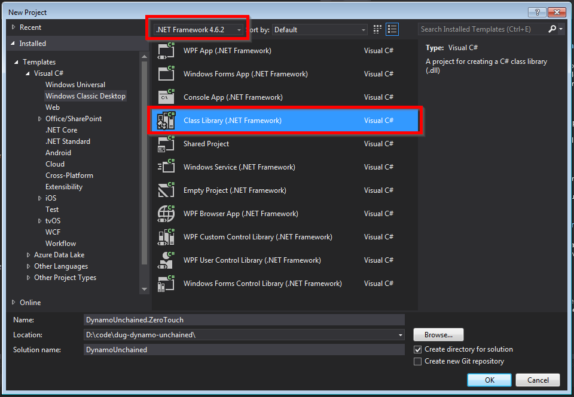

### References

To extend Dynamo at a very basic level (eg. manipulating native .NET data types as strings, numbers…) you don’t need to add any reference. But to interact with its geometry types we need to add a few. We’ll be using NuGet, as it makes referencing super easy and it lets you build your node even without Dynamo or Revit installed. 

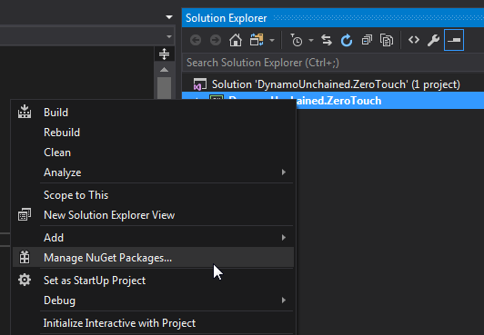

For now we need `DynamoVisualProgramming.ZeroTouchLibrary` which depends on `DynamoVisualProgramming.DynamoServices` and will be downloaded automatically. Make sure they match your Dynamo version.

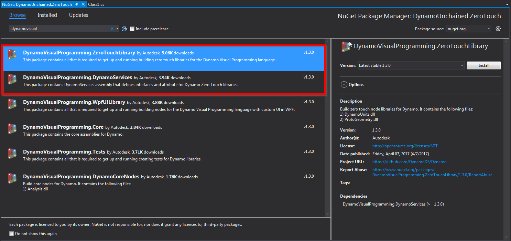

You can see that 4 new dlls have been referenced:

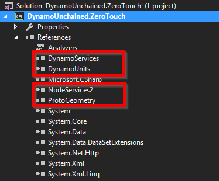

Select them and set *Copy Local* to *False* in the properties:

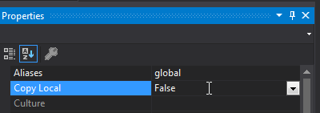

This will avoid unnecessary files in our package.

### Package

A zero touch node needs to be loaded by Dynamo manually each time or be added as a package. We’ll set it up as a **Local Package**, so that it will automatically load every time Dynamo starts. It will also make our life easier in case we decide to publish the packed in the future.

Dynamo packages have the structure below:

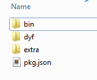

* The *bin* folder houses .dll files created with C# or Zero-Touch libraries

* The *dyf* folder houses the custom nodes, we won’t have any for this package

* The *extra* folder houses all additional files. These files are likely to be Dynamo Files (.dyn) or any additional files required (.svg, .xls, .jpeg, .sat, etc.)

* The *pkg* file is a basic text file defining the package settings. [This is can be automated by Dynamo](http://dynamoprimer.com/en/10_Packages/10-4_Publishing.html), but we will make one from scratch

We'll need to manually create the pkg.json file, but we'll automate the folder creation (we just need the _bin_ folder):

* Right Click on the project > Add > New Item…

* Web > JSON File

* Save as pkg.json

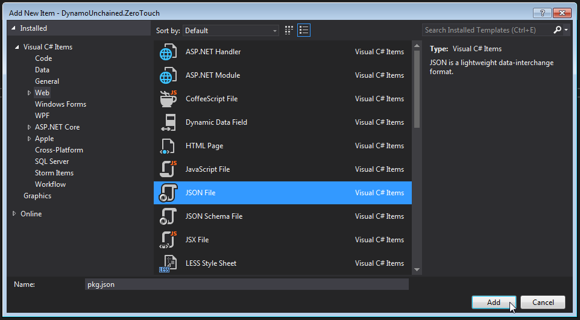

Then copy/paste the following package description, which is some boilerplate JSON code:

```json
{
    "license": "",
    "file_hash": null,
    "name": "Dynamo Unchained - ZeroTouch",
    "version": "1.0.0",
    "description": "ZeroTouch sample node for the Dynamo Unchained workshop",
    "group": "",
    "keywords": null,
    "dependencies": [],
    "contents": "",
    "engine_version": "1.3.0.0",
    "engine": "dynamo",
    "engine_metadata": "",
    "site_url": "",
    "repository_url": "",
    "contains_binaries": true,
    "node_libraries": [
        "DynamoUnchained.ZeroTouch, Version=1.0.0.0, Culture=neutral, PublicKeyToken=null"
    ]
}
```
### Build Events and Start Action

Let’s finally configure the project so that the files are copied automatically into the Dynamo packages folder  after each build in order to Debug our dlls.

Right click on the project > Properties > Debug > Build Events > Post-build event command line > paste the two following lines:

`xcopy /Y "$(TargetDir)*.*" "$(AppData)\Dynamo\Dynamo Core\1.3\packages\$(ProjectName)\bin\"`

`xcopy /Y "$(ProjectDir)pkg.json" "$(AppData)\Dynamo\Dynamo Core\1.3\packages\$(ProjectName)"`

These lines tell VS to copy the dlls we produce in the bin folder, and the pkg.json into the package folder.

> **Note:**
> The commands above point to the current version of Dynamo Sandbox, if you’re using a different version update accordingly. If you are using Dynamo for Revit you should instead use the following commands:
> `xcopy /Y "$(TargetDir)*.*" "$(AppData)\Dynamo\Dynamo Revit\1.3\packages\$(ProjectName)\bin\"`
>
> `xcopy /Y "$(ProjectDir)pkg.json" "$(AppData)\Dynamo\Dynamo Revit\1.3\packages\$(ProjectName)"`

Now right click on the project > Properties > Debug > Start external program > Select 

`C:\Program Files\Dynamo\Dynamo Revit\1.3\DynamoSandbox.exe`

> **Note:**
> The path above points to the current version of Dynamo Sandbox, if you’re using a different version edit accordingly. We are using Sandbox because it’s simpler and faster than Dynamo for Revit.
>
> If you are using Dynamo for Revit you should instead use the Revit path:
> `C:\Program Files\Autodesk\Revit 2018\Revit.exe`

> **Also note:**
> The start action is a user specific setting, not a project setting, you will have to set it again every time the project is cloned.

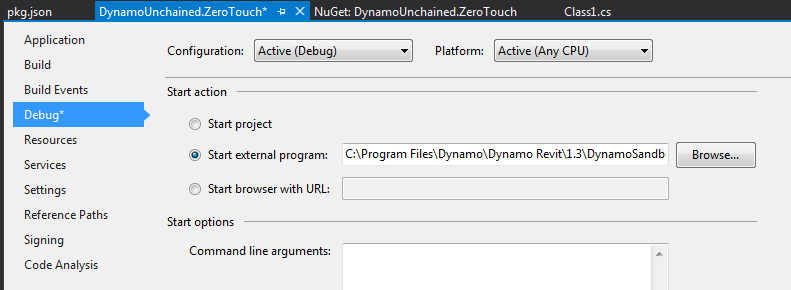


### Hello Dynamo!

It still looks a bit empty in here, let’s add some dummy code so that we can check everything is set up correctly. Add a new class named HelloDynamo.cs, or rename Class1.cs:

```c#
namespace DynamoUnchained.ZeroTouch
{
  public static class HelloDynamo
  {
    public static string SayHello(string Name)
    {
      return "Hello " + Name + "!";
    }
  }
}
```
### Debugging

Before going ahead to debug our code, we need to change a VS setting. This is not required by Dynamo, but Revit instead, we'll do it now for peace of mind.  Go under *Tools > Options... > Debugging > General > Check "Use Managed Compatibility Mode"*. If Managed Compatibility Mode is unchecked and you try debugging within Revit it will crash during startup.

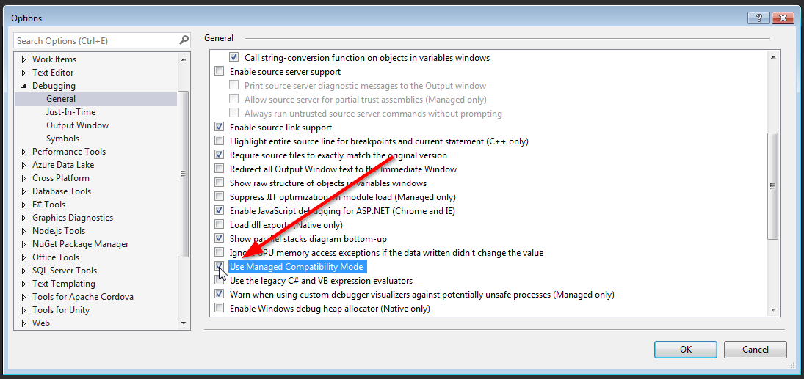

Press F5 or click the green play button to start debugging, Dynamo Sandbox should start automatically. Create a new file, and you should see or new package being loaded:


Now, if you put some breakpoints in VS you’ll be able to get great insights of what’s going on in your code, this will help you fix bugs quicker and improve your dev skills too!

Since we set up our package as a local package, we can actually see it in the list of installed packages:

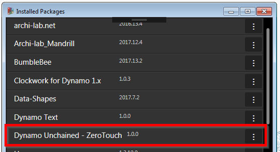

### Naming

One last thing, annoyingly enough, Dynamo didn’t format the Node Name very well. Our node was nested inside DynamoUnchained > ZeroTouch > DynamoUnchained > ZeroTouch.

The first two are taken from the assembly name (the DLL), the last two from the namespace, which in our case are the same.

To  avoid this you can either do the following 2 things:

* change assembly name (and change the corresponding value in pkg.json)

* add a *DynamoUnchained.ZeroTouch_DynamoCustomization.xml* file

I prefer to keep my assembly names unchanged, so let’s add the XML file to the root of our project, then **remember to select it and set its *Build Action* to _Copy always_****.**

```xml
<?xml version="1.0"?>
<doc>
  <assembly>
    <name>DynamoUnchained.ZeroTouch</name>
  </assembly>
  <namespaces>
    <namespace name="DynamoUnchained.ZeroTouch">
      <category>Dynamo Unchained.ZeroTouch</category>
    </namespace>
  </namespaces>
</doc>
```
Debug again, and it'll be much better now:

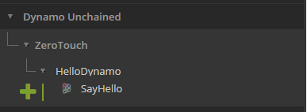


We’ve now finally set up our project correctly, you can save the project and use it in the future as a template. In case you missed some steps you can find the complete project inside the "*DynamoUnchained.ZeroTouch - part 1"* folder.

## Dynamo Node Development - Part 2

In this part we will develop a few sample nodes exploring inputs, outputs and Dynamo's geometry. Since we wont't be interacting with Revit just yet, development will target Dynamo Sandbox. As mentioned previously, each `public static` method that you have in your project will show up as a node in Dynamo. Let’s now see how to add more complex functionalities.

### I/O

Most of your nodes will take one or more inputs, do something with them, and then return one or more outputs. 

#### Inputs

To accept multiple inputs, simply add more input parameters to your functions:

```c#
public static double AverageNumbers(double Number1, double Number2)
{
  return (Number1 + Number2) / 2;
}
```


As you can clearly understand, the above will only accepts the declared input types, to accept any type you can use the `object` type. For lists/arrays, again, just follow normal C# conventions. 

But what happens if you don't know in advance the structure of the incoming data? If you want to handle inputs with variable nesting and single items as well? Use the `[ArbitraryDimensionArrayImport]` attribute (also, make sure you are have the `using Autodesk.DesignScript.Runtime;` directive in your file):

```c#
public static IList AddItemToEnd([ArbitraryDimensionArrayImport] object item, IList list)
{
    return new ArrayList(list) //Clone original list
    {
        item //Add item to the end of cloned list.
    };
}
```
#### Outputs

Returning multiple values is a little bit more tricky, first add the `using Autodesk.DesignScript.Runtime;` directive. Then we need to add a `MultiReturn` attribute to the function and create a dictionary to store our outputs:

```c#
[MultiReturn(new[] { "evens", "odds" })]
public static Dictionary<string, object> SplitOddEven(List<int> list)
{
  var odds = new List<int>();
  var evens = new List<int>();

  //check integers in list if even or odd
  foreach (var i in list)
  {
    if (i % 2 == 0)
    {
      evens.Add(i);
    }
    else
    {
      odds.Add(i);
    }
  }

  //create a new dictionary and return it
  var d = new Dictionary<string, object>();
  d.Add("evens", evens);
  d.Add("odds", odds);
  return d;

  //the above can be simplified in one line with
  //return new Dictionary<string, object> { { "evens", evens }, { "odds", odds } };       
}
```


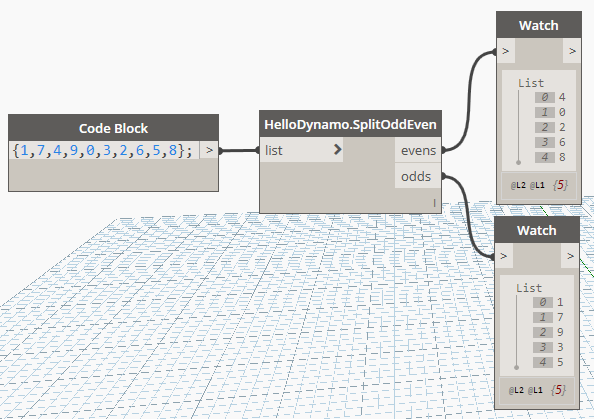


### Dynamo Geometry

To access native Dynamo geometry and methods, you just need to add the `using Autodesk.DesignScript.Geometry;` directive, we can now read element's properties:

```c#
[MultiReturn(new[] { "X", "Y", "Z" })]
public static Dictionary<string, object> PointCoordinates(Point point)
{
  return new Dictionary<string, object> { { "X", point.X }, { "Y", point.Y }, { "Z", point.Z } }; 
}
```

And generate new geometry:

```c#
public static Line ByCoordinates(double X1, double Y1, double Z1, double X2, double Y2, double Z2)
{
  var p1 = Point.ByCoordinates(X1, Y1, Z1);
  var p2 = Point.ByCoordinates(X2, Y2, Z2);

  return Line.ByStartPointEndPoint(p1, p2);
}
```
But **BE CAREFUL!** Each geometry object that you create in your functions will use Dynamo resources, therefore if it's not needed or returned by your methods it should be disposed, either like this:

```c#
public static Line ByCoordinates(double X1, double Y1, double Z1, double X2, double Y2, double Z2)
{
  var p1 = Point.ByCoordinates(X1, Y1, Z1);
  var p2 = Point.ByCoordinates(X2, Y2, Z2);
  var l = Line.ByStartPointEndPoint(p1, p2);
  p1.Dispose();
  p2.Dispose();
  return l;
}
```
Or with a `using` statement:

```c#
public static Line ByCoordinates(double X1, double Y1, double Z1, double X2, double Y2, double Z2)
{
  using (var p1 = Point.ByCoordinates(X1, Y1, Z1))
  {
    using (var p2 = Point.ByCoordinates(X2, Y2, Z2))
    {
      return Line.ByStartPointEndPoint(p1, p2);
    }
  }
}
```
## Revit Node Development - Part 3

Everything covered so far will run smoothly in Dynamo Sandbox and it's great to use it to get started developing nodes, but soon enough you'll want to be interacting with Revit elements too. A great thing of zero touch nodes is that they'll let you use the Revit and Dynamo API at the same time, this might be a bit confusing but we'll see soon how to do that, the [revitapidocs](http://www.revitapidocs.com/) website is great to get familiar with the Revit API. The Revit elements you access inside of Dynamo are not the native ones, but are *wrappers* around them, we'll also see more in detail what this means.

### References

We need to add 3 more references manually, as these don't come as NuGet packages. 

Right click on references > Add Reference > Browse...


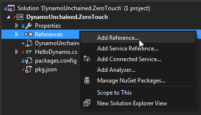

Browse and add the following DLLs, the first to the Revit API:

`C:\Program Files\Autodesk\Revit 2018\RevitAPI.dll`

Then to the Dynamo Revit Nodes and Services

`C:\Program Files\Dynamo\Dynamo Revit\1.3\Revit_2018\RevitNodes.dll`

`C:\Program Files\Dynamo\Dynamo Revit\1.3\Revit_2018\RevitServices.dll`

Again, remember to select these newly added references and to set *Copy Local* to *False*.

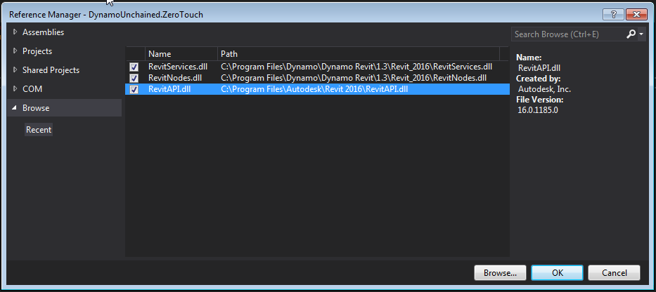

As mentioned earlier, since now we'll be building and debugging for Revit, you now need to update your [start action and build events](#Start-Action-and-Build-Events).

### Code Example 1

Let's create a new `public static class` named `HelloRevit`. We will need to add the following directives corresponding to the new references:

`using Autodesk.Revit.DB;`
`using Revit.Elements;`
`using RevitServices.Persistence;`

If now you create a new method that uses the `Wall` object, for instance, you'll see the following error:


Visual Studio, isn't sure if we mean a native Revit wall or a Dynamo wall. We can fix that by typing the full namespace as:


Let's now explore how we can write a node that takes in some Walls and outputs their baseline curves. Write a new function:

```c#
public static Autodesk.DesignScript.Geometry.Curve GetWallBaseline(Revit.Elements.Wall wall)
{
  //get Revit Wall
  var revitWall = wall.InternalElement;
  //revit API
  var locationCurve =  revitWall.Location as LocationCurve;
  //convert to Dynamo and return it
  return locationCurve.Curve.ToProtoType();
}
```
This isn't too exciting, but hey, you wrote your first ZTN for Revit! The code also shows us how to *unwrap* a Dynamo wall to get the native Revit one, and how to *convert* a Revit curve into a Dynamo one, a fundamental part of zero touch nodes.

### Wrapping, Unwrapping and Converting

The following lists show some of the most common extension methods that you might need, they take care of conversion of Revit elements and geometry to Dynamo ones and vice-versa. 

#### From Revit to Dynamo

```C#
//Elements
Element.ToDSType(bool); //true if it's an element generated by Revit
//Geometry
XYZ.ToPoint() > Point
XYZ.ToVector() > Vector
Point.ToProtoType() > Point
List<XYZ>.ToPoints() > List<Point>
UV.ToProtoType() > UV
Curve.ToProtoType() > Curve
CurveArray.ToProtoType() > PolyCurve
PolyLine.ToProtoType() > PolyCurve
Plane.ToPlane() > Plane
Solid.ToProtoType() > Solid
Mesh.ToProtoType() > Mesh
IEnumerable<Mesh>.ToProtoType() > Mesh[]
Face.ToProtoType() > IEnumerable<Surface> 
Transform.ToCoordinateSystem() > CoordinateSystem
BoundingBoxXYZ.ToProtoType() > BoundingBox
```
#### From Revit to Dynamo

```C#
//Elements
Element.InternalElement
//Geometry
Point.ToRevitType() > XYZ
Vector.ToRevitType() > XYZ
Plane.ToPlane() > Plane
List<Point>.ToXyzs() > List<XYZ>
Curve.ToRevitType() > Curve
PolyCurve.ToRevitType() > CurveLoop
Surface.ToRevitType() > IList<GeometryObject>
Solid.ToRevitType() > IList<GeometryObject>
Mesh.ToRevitType() > IList<GeometryObject>
CoordinateSystem.ToTransform() > Transform
CoordinateSystem.ToRevitBoundingBox() > BoundingBoxXYZ
BoundingBox.ToRevitType() > BoundingBoxXYZ
```


### Code Example 2

We're now going to do something more complex, we will write a custom node that takes in a string, converts the text shape into lines and uses those lines to place walls. 

Create a new `TextUtils` class as below:

```c#
using System.Collections.Generic;
using System.Linq;
using Autodesk.DesignScript.Runtime;
using Autodesk.DesignScript.Geometry;
using System.Drawing;
using System.Drawing.Drawing2D;

namespace DynamoUnchained.ZeroTouch
{
  public static class TextUtils
  {
    /// <summary>
    /// Converts a string into a list of segments
    /// </summary>
    /// <param name="text">String to convert</param>
    /// <param name="size">Text size</param>
    /// <returns></returns>
    [IsVisibleInDynamoLibrary(false)]
    public static IEnumerable<Line> TextToLines(string text, int size)
    {
      List<Line> lines = new List<Line>();

      //using System.Drawing for the conversion to font points
      using (Font font = new System.Drawing.Font("Arial", size, FontStyle.Regular))
      using (GraphicsPath gp = new GraphicsPath())
      using (StringFormat sf = new StringFormat())
      {
        sf.Alignment = StringAlignment.Center;
        sf.LineAlignment = StringAlignment.Center;

        gp.AddString(text, font.FontFamily, (int)font.Style, font.Size, new PointF(0, 0), sf);

        //convert font points to Dynamo points
        var points = gp.PathPoints.Select(p => Autodesk.DesignScript.Geometry.Point.ByCoordinates(p.X, -p.Y, 0)).ToList();
        var types = gp.PathTypes;

        Autodesk.DesignScript.Geometry.Point start = null;
        //create lines
        for (var i = 0; i < types.Count(); i++)
        {
          //Types:
          //0 start of a shape
          //1 point in line
          //3 point in curve
          //129 partial line end
          //131 partial curve end
          //161 end of line
          //163 end of curve
          if (types[i] == 0)
          {
            start = points[i];
          }
          //some letters need to be closed other no
          if (types[i] > 100)
          {
            if (!points[i].IsAlmostEqualTo(start))
            {
              lines.Add(Line.ByStartPointEndPoint(points[i], start));
            }
          }
          else
          {
            lines.Add(Line.ByStartPointEndPoint(points[i], points[i + 1]));
          }
        }
        //dispose points
        foreach (var point in points)
        {
          point.Dispose();
        }
        return lines;
      }
    }
  }
}
```
We don't need to get into detail, this class simply converts a string text into lines, note the `[IsVisibleInDynamoLibrary(false)]` attribute that prevents it from showing up in Dynamo. For it to work you need to add a reference to `System.Drawing` in References > Add Reference... > Assemblies > Framework.

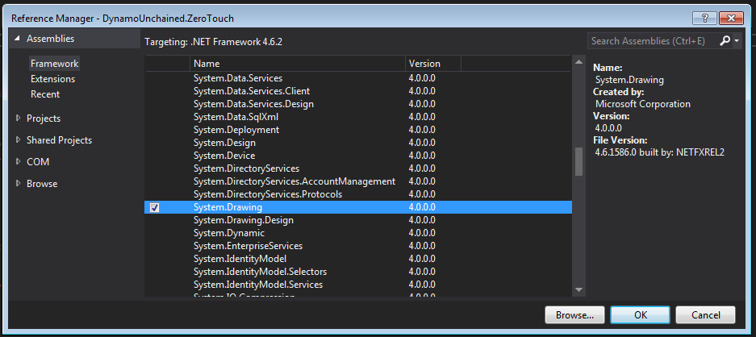

Add these two new functions to the `HelloRevit` class:

```C#
public static IEnumerable<Revit.Elements.Wall> SayHello(string text, double height, Revit.Elements.Level level, Revit.Elements.WallType wallType, int fontSize = 25)
{

}

internal static Autodesk.Revit.DB.Document Document
{
  get { return DocumentManager.Instance.CurrentDBDocument; }
}
```

The `SayHello` method will take a string, a wall height, a level, a wall type and an optional font size. Before proceeding we need to make sure these are valid values:

```C#
  if (level == null)
  {
    throw new ArgumentNullException("level");
  }

  if (wallType == null)
  {
    throw new ArgumentNullException("wallType");
  }
```
Then we can call our utility method to generate the lines from the text with: 

`var lines = TextUtils.TextToLines(text, fontSize);`

Now, you'd be very tempted to write something like the loop below, using the Dynamo API for generating new walls, but beware! Because of an intrinsic mechanism called *element binding* (that can't be turned off), the loop would only return a single element.  The right way to loop and generate multiple elements is using the Revit API.

Dynamo API (wrong method):

```C#
  var walls = new List<Revit.Elements.Wall>();
  foreach (var curve in lines)
  {      
      walls.Add(Revit.Elements.Wall.ByCurveAndHeight(curve, height, level, wallType));
  }
```
Revit API (right method):

```C#
  var walls = new List<Revit.Elements.Wall>();
  //elements creation and modification has to be inside of a transaction
  TransactionManager.Instance.EnsureInTransaction(Document);
  foreach (var curve in lines)
  {
      var wall = Autodesk.Revit.DB.Wall.Create(Document, curve.ToRevitType(), wallType.InternalElement.Id, level.InternalElement.Id, height, 0.0, false, false);
      walls.Add(wall.ToDSType(false) as Revit.Elements.Wall);
  }
```
Whenever you are using the Revit API to create or modify elements, these methods need to be wrapped inside a transaction. This is handled automatically when calling Dynamo methods. 

After this, the last code example is complete, you can now debug the project and see the node in action, mind to use the right units for *height* and *size*, as in my case where the project is in meters:


## Conclusion

The boilerplate poject we have created in part 1, should get you jump-started in developing for Dynamo. Don't be afraid of Visual Studio, it's a friend and it can provide very helpful insights during development and debug. We have also gone through sample code on how to interact with Dynamo and Revit geometry/elements, you should now be able to start developing your own nodes. There are some additional things to be aware of:

* Version updates - releasing updates to an existing node should be done carefully, it could brake existing user graphs and workflows
* Dll conflicts - if other nodes in use by Dynamo depend on external dlls, and your nodes too, there might be conflicts

Happy coding!

##  Additional Resources

* C# Classes : https://www.tutorialspoint.com/csharp/csharp_classes.htm
* C# Namespaces: https://www.tutorialspoint.com/csharp/csharp_namespaces.htm
* Adding Icons for a Zero Touch Assembly: https://github.com/DynamoDS/Dynamo/wiki/Add-Icons-for-a-Zero-Touch-Assembly
* Revit API online documentation: http://www.revitapidocs.com/
* Dynamo Primer: [http://dynamoprimer.com/en/09_Custom-Nodes/9-1_Introduction.html](http://dynamoprimer.com/en/09_Custom-Nodes/9-1_Introduction.html)
* Zero Touch Plugin Development: [https://github.com/DynamoDS/Dynamo/wiki/Zero-Touch-Plugin-Development](https://github.com/DynamoDS/Dynamo/wiki/Zero-Touch-Plugin-Development)
* How to Create Your Own Nodes: [https://github.com/DynamoDS/Dynamo/wiki/How-To-Create-Your-Own-Nodes](https://github.com/DynamoDS/Dynamo/wiki/How-To-Create-Your-Own-Nodes)
